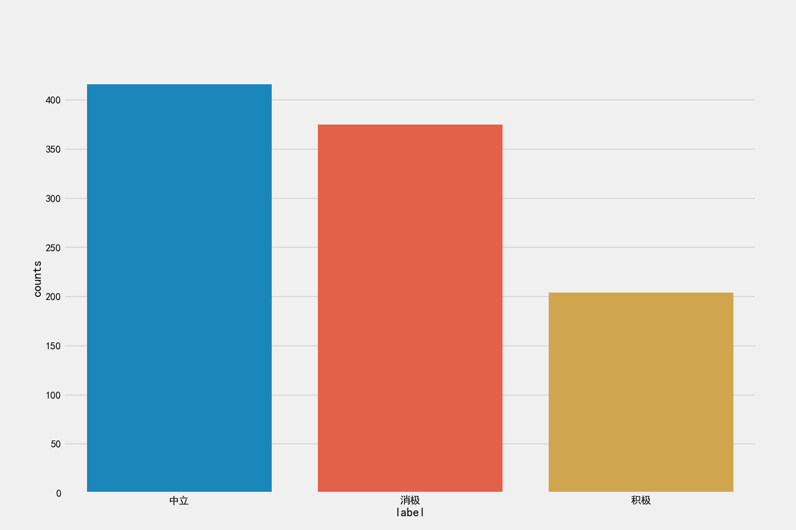
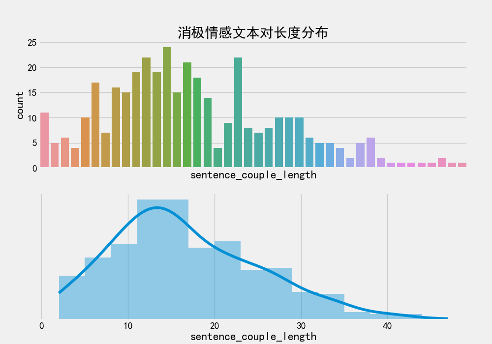
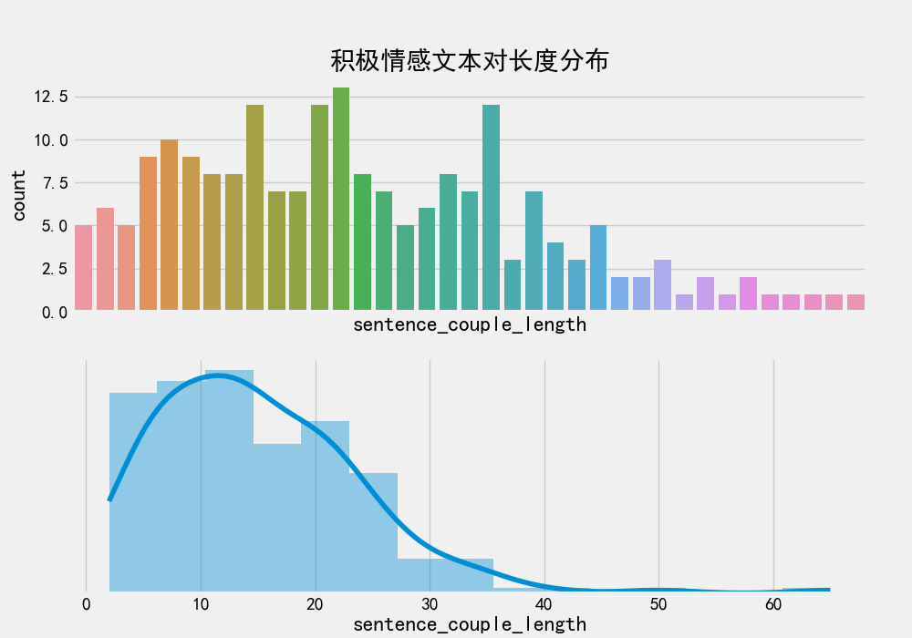
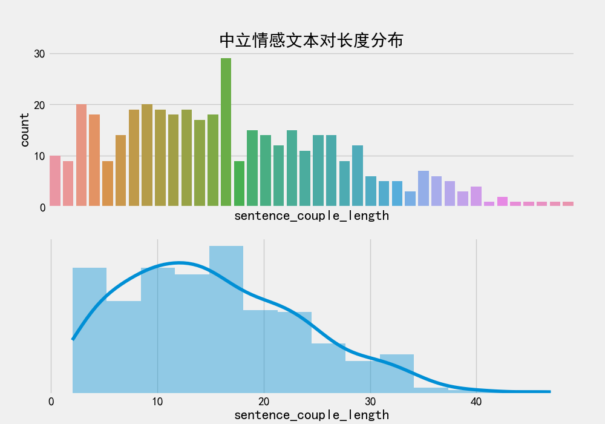

### 任务简述

* 数据是AI项目的核心，在这里我们从数据介绍开始我们的第一个任务。在该任务中，我们需要了解直播间的数据形式，掌握样本的定义方式以及实现数据分析的流程。对该项目的数据有一个深刻的认知。与此同时，我们也会在这里首先构建起一项服务，它将是我们最后提供的模型API，在当前任务中先搭起一个框架，之后的各个任务将进行补充。

### 任务目的

* 了解对当前项目的数据，实现数据分析与预处理过程，并搭建起模型服务框架。


### 任务步骤
	
* Step1: 在服务器上搭建虚拟环境
* Step2: 将原始数据转换成训练语料
* Step3: 对语料进行数据分析
* Step4: 搭建Flask服务框架


---


#### Step1: 在服务器上搭建虚拟环境

* 当前步骤简述：
	* 在企业里，每一个项目都会分解任务给不同的工程师，每个人都可能使用不同的技术栈，因此需要搭建不同虚拟环境。我们当前的项目也会建立虚拟环境；在这个任务步骤中，我们将搭建情感分析虚拟环境：ms3.7（3.7是python的版本）。


* 当前步骤的目标：
	* 使用conda搭建起情感分析虚拟环境：ms3.7

* 环境版本要求：
	* 系统版本：centos7.9
	* 虚拟环境python版本：python3.7
	* python中的工具包版本：
		* pyaitools==1.4.3
		* flask==1.1.1
		* gunicorn==20.0.4
		* xlrd==1.1.0
		* seaborn==0.10.1
		* pandas==1.0.5
		* torch==1.4.0
		* transformers==2.5.1
		* scikit-learn==0.19.2
		* tensorboardX==2.5
		* torchcontrib==0.0.2


#### 让我们动手做起来吧！


* 1, 下载安装Anaconda3，其中就包括虚拟环境工具conda以及python环境。

```shell
# 解压Anaconda3需要bzip2，所以在这里需要先安装
yum install -y bzip2

# 进入指定的安装包下载路径，这里是root路径
cd /root 

# 使用curl进行远程安装包下载
curl -O https://repo.anaconda.com/archive/Anaconda3-5.2.0-Linux-x86_64.sh
# 以下是最新的anaconda3地址，使用哪一个都可以
# curl -O https://repo.anaconda.com/archive/Anaconda3-2021.11-Linux-x86_64.sh


# 使用sh命令进行安装，中间出现的各种说明，按照默认"yes"即可
sh Anaconda3-5.2.0-Linux-x86_64.sh

# 配置~/.bashrc
vim ~/.bashrc
# 添加一行: 
export PATH=/root/anaconda3/bin/:$PATH

# 关闭文件，进行source生效即可
source ~/.bashrc
``` 


* 2，使用conda创建虚拟环境

```shell
# 创建名字为ms3.7的虚拟环境，使用python版本为3.7
conda create -n ms3.7 python=3.7

# 根据提示激活环境
conda activate ms3.7
# 或者
source activate ms3.7
```


* 3，创建项目路径

```shell
cd /
mkdir data
cd /data/
# 在/data路径下创建名为 sentiment_project 的项目路径
mkdir sentiment_project
```


* 4，创建requirements.txt文件并进行工具包安装

```shell
# 在/data/sentiment_project路径下打开requirements.txt文件
vim requirements.txt

# 在requirements.txt中写入必要的安装包版本
 
# pyaitools==1.4.3
# flask==1.1.1
# gunicorn==20.0.4
# xlrd==1.1.0
# seaborn==0.10.1
# pandas==1.0.5
# torch==1.4.0
# transformers==2.5.1
# scikit-learn==0.19.2
# tensorboardX==2.5
# torchcontrib==0.0.2

# 在虚拟环境ms3.7中安装以下工具包
pip install -r requirements.txt
```


* 5，虚拟环境激活

```shell
conda activate ms3.7
```


* 当前步骤总结：
	* 到这里，我们就已经搭建起ms3.7的项目环境，在接下来的开发中，每次登陆服务器我们需要激活该环境，在其中进行一些列的开发。


---

#### Step2: 将原始数据转换成训练语料


* 当前步骤简述：
	* 在这里我们将介绍原始数据，并需要实现到训练语料的过程，这个过程中包括：标签的定义，"文本对"样本的构造等过程。


* 原始数据来源：
	* 我们通过在素人直播间设置“打点”，采集每个直播间的粉丝对话内容，对其进行标注。

* 标签的定义：
	* positive 积极: 是指对素人主播的赞赏，夸奖，称赞等语言
	* neutral 中性: 一般直播间闲聊对话
	* negtive 消极: 对素人主播的诋毁，打击等语言


* 直播间对话内容如下图：
	* 对于标签的严格度标注团队有自己的规范，根据不同地区的管制标准，容忍度会存在不同。


* "文本对"样本的构造原因：
	* 因为直播间对话较短，单句表达的语义或情感往往不明确，因此需要结合当前文本的上文信息，因此不同传统情感分析，这里采用的是[当前句] + [当前句的上一句]共同来判断[当前句]的情感状态，因此模型输入的形式为文本对。

* 关于开源语料的使用：
	* 数据资源是企业的机密资源，因此项目的实际训练语料会选择形式类似的开源语料，来保证我们的项目各个环节都可以run通。真实语料的内容我们已经通过标签的定义和直播间对话内容进行了了解，在后面的训练及其优化过程中，我们也会给出企业真实语料的训练情况和实验效果，完全不会影响技术面试和分享（聚焦技术本身）。
	* 在这里我们使用开源数据集dev_sent_emo.csv，下载地址详见附录。


* 开源数据处理程序：
	* 将开源数据处理成我们需要的数据形式，这个过程大家可以简单参考，因为实际项目中，我们直接从数据团队拿到了这个程序处理之后的数据样式。
	* 代码路径：
		* /data/sentiment_project/data/data_preprocess.py  


```python3
import os.path
import numpy as np

import pandas as pd


class DataPreprocess():

    def __init__(self, data_file):
        '''
        :param data_file: 原始数据文件
        '''
        self.data_file = data_file

    def concat_columns(self, df):
        '''
        :param df:
        :return:
        '''
        samples = []
        length = len(df.values)
        arrays = df.values
        for i, arr in enumerate(arrays):
            if i < length - 1:
                # [句子1，句子2，情感标签，Dialogue_ID]
                sample = [arr[0], arrays[i + 1][0], arrays[i + 1][1], arrays[i + 1][2]]
                samples.append(sample)
        if samples:
            return samples
        return None

    def load_data(self):
        # 使用pandas提供的read_csv函数读取原始数据
        df = pd.read_csv(self.data_file)
        # ['Sr No.', 'Utterance', 'Speaker', 'Emotion', 'Sentiment', 'Dialogue_ID', 'Utterance_ID', 'Season', 'Episode', 'StartTime', 'EndTime']
        # 我们先按 Dialogue_ID 进行分组
        # 将同一个Dialogue_ID的对话数据存到新列 sample 中类型为list，列表中每个元素包含：上下两句话、对应的情感标签、Dialogue_ID
        df['sample'] = df.groupby(['Dialogue_ID'])['Utterance', 'Sentiment', 'Dialogue_ID'].apply(self.concat_columns)
        df = df[['sample', 'Dialogue_ID']]
        # 删除样本为空的列
        df.dropna(subset=['sample'], inplace=True)
        # 将样本对取出，分成3列，生成新的DataFrame，列名：Dialogue_ID，sentence1，sentence2，Sentiment
        samples = np.concatenate(df['sample'].values)
        sentence1 = samples[:, 0].tolist()
        sentence2 = samples[:, 1].tolist()
        Sentiment = samples[:, 2].tolist()
        Dialogue_IDs = samples[:, 3].tolist()
        df = pd.DataFrame(
            {'Dialogue_ID': Dialogue_IDs, 'sentence1': sentence1, 'sentence2': sentence2, 'Sentiment': Sentiment})
        # 输出所有数据
        df.to_csv('./data.csv', index=False)
        data = df.values.tolist()
        return data

    def split_train_test(self, datas, train_file, dev_file, ratios=[0.8, 0.2]):
        '''
        划分数据
        :param datas:  预处理后的数据
        :param train_file: 训练数据保存目录文件
        :param dev_file: 验证数据保存目录文件
        :param ratios: 划分比例
        :return:
        '''
        # 打乱顺序
        np.random.seed(2022)  # 设置随机数种子，保证每次数据集划分都是一样的。
        e_index = np.arange(len(datas))  # 生成下标
        np.random.shuffle(e_index)
        all_data = list(np.array(datas)[e_index])
        # 数据划分
        num = len(all_data)
        offset = int(num * ratios[0])
        train_data = all_data[:offset]
        dev_data = all_data[offset:]
        # 将训练集、验证集、测试集数据写入到不同文件
        self.write_split_data(train_data, dev_data, train_file, dev_file)
        print("train:", len(train_data), "dev", len(dev_data))

    def write_split_data(self, trains, devs, train_file, dev_file):
        # 列名
        columns = ['Dialogue_ID', 'sentence1', 'sentence2', 'Sentiment']
        # 将训练数据、验证数据、测试数据保存到不同的文件
        pd.DataFrame(trains, columns=columns).to_csv(train_file, index=False, sep="\t")
        pd.DataFrame(devs, columns=columns).to_csv(dev_file, index=False, sep="\t")


if __name__ == '__main__':
    base= '/data/sentiment_project/'
    data_file = os.path.join(base, 'data/dev_sent_emo.csv')
    processor = DataPreprocess(data_file)
    data = processor.load_data()
    train_file = os.path.join(base, 'data/train.tsv')
    dev_file = os.path.join(base, 'data/dev.tsv')
    processor.split_train_test(data, train_file, dev_file)
```

> * 输出效果：

```text
train: 796 dev 199
```


* 我们生成了data.csv(全集)，train.tsv，dev.tsv文件，用于训练和验证，实际工程中，数据量级要大的多，根据每轮迭代数据集都会有一定的扩充，数据量大致为50000+，而验证集的数量也至少在10000+。


#### Step3: 对语料进行数据分析

* 当前步骤简述：
	* 对文本进行数据分析是必不可少的工作流程，其中包括文本长度分布，标签数量分布。


* 文本长度分布：
	* 了解当前"文本对"的长度范围，我们按照标签进行获取，帮助判定进入模型的max_length参数选择。

* 标签数量分布：
	* 查看各个标签的分布情况，以便及时采取措施应对标签不均衡问题。


* 输入：
	* 针对上一步得到的data.csv数据全集进行分析

* 输出：
	* "文本对"长度分布图和标签数量分布图


* 代码实现位置：
	* /data/sentiment_project/data/data_analysis.py


#### 让我们动手做起来吧！


* 代码实现：

```python
import os
import matplotlib.pyplot as plt
import pandas as pd
import seaborn as sns

#plt.rcParams['font.family'] = 'DejaVu Sans'
plt.rcParams['font.sans-serif']=['simhei'] #用来正常显示中文标签
plt.style.use('fivethirtyeight')

def plot_length(data_path, save_path):
    '''
     不同标签的数据长度统计分析
    :param data_path:
    :param save_path:
    :return:
    '''
    # 使用pandas的read_csv函数读取数据
    df = pd.read_csv(data_path)
    # 统计每个标签的类别数量
    df_positive = df[df['Sentiment'] == 'positive']
    df_neutral = df[df['Sentiment'] == 'neutral']
    df_negative = df[df['Sentiment'] == 'negative']
    dfs = [df_positive, df_neutral, df_negative]
    sentiments = ['积极', '中立', '消极']
    sentiments_en = ['positive', 'neutral', 'negative']
    # 绘制不同标签下文本对的长度
    for i, df in enumerate(dfs):
        fig, ax = plt.subplots(2, 1, figsize=(10,7))
        title = '%s情感文本对长度分布' % sentiments[i]
        ax[0].set_title(title)
        ax[1].set_yticks([])
        # 图片的保存目录
        save_image = save_path + '%s_length_image.png' % sentiments_en[i]
        # 计算句子对的长度
        df['sentence_couple_length'] = df[['sentence1', 'sentence2']].apply(
            lambda x: len(x['sentence1'].split()) + len(x['sentence2'].split()), axis=1)
        sns.countplot("sentence_couple_length", data=df[['sentence_couple_length']], ax=ax[0])
        sns.distplot(df["sentence_couple_length"],kde_kws={'cut': 0}, ax=ax[1])
        ax[0].set_xticks([])
        plt.savefig(save_image)
    plt.cla()


def plot_label(data_path, save_image):
    '''
    绘制标签数量分布图
    :param data_path: 数据文本
    :param save_image: 图片保存目录
    :return:
    '''
    fig, ax = plt.subplots(1, 1, figsize=(15, 10))
    df = pd.read_csv(data_path)[['Sentiment']]
    label_map = {'neutral': '中立', 'negative': '消极', 'positive': '积极'}
    s_counts = df.value_counts()
    labels = [label_map.get(label[0]) for label in s_counts.index.values]
    df_label = pd.DataFrame({'label': labels, 'counts': s_counts.values})
    sns.barplot(x='label', y='counts', data=df_label,ax=ax)
    plt.savefig(save_image)
    plt.cla()


if __name__ == '__main__':
    base = '/data/sentiment_project/data'
    data_path = os.path.join(base, 'data.csv')
    save_image = os.path.join(base, 'images/')
    plot_length(data_path, save_image)
    label_count_file_path = os.path.join(base, 'images/label_image.png')
    plot_label(data_path, label_count_file_path)
```


> * 输出效果：
	* 我们会在./images路径下获得四张png图片








* 当前步骤总结：
	* 通过对语料数据的一系列分析，我们就可以判断大致上模型应该选择的max_length参数为40，而标签中positive相对较少，我们将在后续的过程中对其进行均衡。


---


#### Step4: 搭建Flask服务框架

* 当前步骤简述：
	* 前面的步骤中我们已经将数据了解的差不多了，在这一步，我们学习构建基于Flask的模型服务。

* Flask服务简介：
	* Flask框架是当下最受欢迎的python轻量级框架, 也是pytorch官网指定的部署框架. Flask的基本模式为在程序里将一个视图函数分配给一个URL，每当用户访问这个URL时，系统就会执行给该URL分配好的视图函数，获取函数的返回值.
	* 为了保证服务的健壮性，Flask常常与gunicorn一同使用。

* 业界服务的选择说明：
	* 对性能和并发要求不是很高的情况，建议使用基于http协议的服务（Flask），该协议通信成本是较高的，但是API接口方面更加人性化，能有效减少开发和测试的工作量，避免出现bug。
	* 对性能和并发要求高一些的情况，建议使用基于TCP协议的服务，该协议通信成本是较低的。
	* 对性能和并发要求很高的情况，模型会编译成后台语言（如C++）直接调用的形式, 我们称作local模式，避免服务之间的通信。


* 安装必要的python工具包：

```shell
pip install Flask==1.1.1
pip install gunicorn==20.0.4
```


* 代码实现位置：
	* /data/sentiment_project/ModelServer/app.py


* 注：
	* 这里不需要写模型预测的具体过程，只要服务正常启动就可以，之后我们会再丰富这个服务里面的内容。

---

#### 让我们动手做起来吧！


* 代码实现：

```python
# Flask框架固定工具
from flask import Flask
from flask import request

app = Flask(__name__)

from config import model_path

# 定义服务请求路径和方式，使用POST请求
@app.route("/v1/model_prediction/",methods=["POST"])
def model_prediction():
    request_json = request.get_json()
    sentence1 = request_json['sentence1']
    sentence2 = request_json['sentence2']
    # 按照正常逻辑返回标签以及对应的得分列表
    predicted_labels = "positive"
    score = 1
    return str([predicted_labels, score])
```

> * 运行示例：

```python
nohup gunicorn -w 1 -b 0.0.0.0:5003  app:app &
```


* 编写测试脚本：
	* 该脚本将写在/data/sentiment_project/ModelServer/api_test.py中

```python3
url = "http://0.0.0.0:5003/v1/model_prediction/"
sentence1 = "Oh, my god"
sentence2 = "Good!"

data = {"sentence1": sentence1, "sentence2": sentence2}
res = requests.post(url, json=data, timeout=200)
print(res.text)
```


```text
["positive", 1]
```


* 当前步骤总结：
	* 在这里，我们构建了基础的Flask服务，之后我们将在其他任务中补充相关模型，使其具备预测功能。

