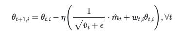

### 任务简述


* 通过任务一我们完成训练数据的分析和准备，在当前任务中，我们将使用经典的BERT多语言模型建立指标基线，借助huggingface提供的工具完成该过程。与此同时，还会对重要的超参数，如lr，weight decay等进行一些调整，来提升基线水平。


### 任务目的

* 使用BERT系列模型训练获得基线指标并进行超参数调优


### 任务步骤
	
* Step1: 根据现有任务选择标准任务类型 
* Step2: 使用微调脚本进行训练和验证
* Step3: 重要的超参数调优


---


#### Step1: 根据现有任务选择标准任务类型

* 当前步骤简述：
	* 我们决定使用主流的BERT系列模型来进行"文本对"类别的判断，选择的工具是huggingface微调脚本，一旦选择这样的工具，我们就需要对工具的使用有一定的理解。


* 创建微调脚本run_glue.py，具体代码内容见附录
	* 代码位置：/data/sentiment_project/run_glue.py

* 微调脚本说明：
	* run_glue.py是huggingface团队将BERT系列模型应用在标准数据集GLUE（[关于GLUE](https://blog.csdn.net/weixin_43891607/article/details/121666324?spm=1001.2014.3001.5501)）时使用的训练脚本，我们在使用时，只需要将读取的数据集改成我们自己的，同时在GLUE中找到和我们任务形式（文本对三分类）相同的任务即可复用。


* 微调脚本参数说明：
	* --model_type: 选择需要微调的模型类型, 这里可以选择BERT, XLNET, XLM, roBERTa, distilBERT, ALBERT
	* --model_name_or_path: 选择具体的模型或者变体, 如：bert-base-uncased
	* --task_name: 它将代表对应的任务类型, 如MNLI代表文本对三分类任务
	* --do_train: 使用微调脚本进行训练
	* --do_eval: 使用微调脚本进行验证
	* --data_dir: 训练集及其验证集所在路径, 将自动寻找该路径下的train.tsv和dev.tsv作为训练集和验证集
	* --max_seq_length: 输入句子的最大长度, 超过则截断, 不足则补齐
	* --learning_rate: 学习率
	* --num_train_epochs: 训练轮数
	* --save_steps: 检测点保存步骤间隔
	* --logging_steps: 日志打印步骤间隔
	* --output_dir $SAVE_DIR: 训练后的模型保存路径

* 选择的任务类型说明：
	* 从上面的参数中可以看出，task_name是必须选择的已有标准任务中的任务，这里我们选择MNLI-MM，MNLI-MM早期也是GLUE之前的标准任务之一，后来融合到MNLI，但是我们使用的这个版本的transformers仍然支持MNLI-MM。


* 当前步骤总结：
	* 这一步并没有太多的程序的部分，更多是让大家了解一下huggingface这样一个工具，现在在NLP深度学习领域该工具的使用已成为主流。


---

#### Step2: 使用微调脚本进行训练和验证  


* 当前步骤简述：
	* 通过步骤一我们已经了解的这个run_glue.py微调脚本的相关情况，这一步，我们就要使用它在我们的数据上进行模型的训练和验证。


* 代码实现位置：
	* /data/sentiment_project/start_train.sh


#### 让我们动手做起来吧！


* 代码实现：

```shell
# 定义DATA_DIR: 微调数据所在路径, 这里我们使用data中的数据作为微调数据
export DATA_DIR="./data"
# 定义SAVE_DIR: 模型的保存路径, 我们将模型保存在当前目录的checkpoints文件中
export SAVE_DIR="./checkpoints/"

python run_glue.py \
  --model_type BERT \
  --model_name_or_path bert-base-multilingual-cased \
  --task_name MNLI-MM \
  --do_train \
  --do_eval \
  --data_dir $DATA_DIR/ \
  --max_seq_length 40 \
  --learning_rate 2e-5 \
  --num_train_epochs 20 \
  --weight_decay 0 \
  --save_steps 2000 \
  --logging_steps 2000 \
  --overwrite_output_dir \
  --output_dir $SAVE_DIR
```


> * 运行示例：

```python
sh run_glue.sh
```


* 直接运行将可能出现以下的问题:


```text
Traceback (most recent call last):
  File "run_glue.py", line 536, in <module>
    main()
  File "run_glue.py", line 486, in main
    train_dataset = load_and_cache_examples(args, args.task_name, tokenizer, evaluate=False)
  File "run_glue.py", line 301, in load_and_cache_examples
    examples = processor.get_dev_examples(args.data_dir) if evaluate else processor.get_train_examples(args.data_dir)
  File "/root/anaconda3/envs/ms3.7/lib/python3.7/site-packages/transformers/data/processors/glue.py", line 207, in get_train_examples
    self._read_tsv(os.path.join(data_dir, "train.tsv")), "train")
  File "/root/anaconda3/envs/ms3.7/lib/python3.7/site-packages/transformers/data/processors/glue.py", line 226, in _create_examples
    text_a = line[8]
IndexError: list index out of range

```

* 列表索引越界问题是因为我们现在给模型输入的数据列和标准MNLI的数据列不同导致的。因此我们需要根据对MNLI训练数据和我们已有数据的列进行对比，以便修改源码中一部分数据读取和标签设定信息。

> * 修改1：对于读取的输入数据，我们知道原标准任务中共12列，而我们的数据中只有4列，修改文件"/root/anaconda3/envs/ms3.7/lib/python3.7/site-packages/transformers/data/processors/glue.py"中的第226行。

```python
219     def _create_examples(self, lines, set_type):
220         """Creates examples for the training and dev sets."""
221         examples = []
222         for (i, line) in enumerate(lines):
223             if i == 0:
224                 continue
225             guid = "%s-%s" % (set_type, line[0])
226             text_a = line[8]
227             text_b = line[9]
228             label = line[-1]
229             examples.append(
230                 InputExample(guid=guid, text_a=text_a, text_b=t    ext_b, label=label))
231         return examples


# ------- 修改为 --------

# 把8，9列改成1，2列


219     def _create_examples(self, lines, set_type):
220         """Creates examples for the training and dev sets."""
221         examples = []
222         for (i, line) in enumerate(lines):
223             if i == 0:
224                 continue
225             guid = "%s-%s" % (set_type, line[0])
226             ####
227             # text_a = line[8]
228             # text_b = line[9]
229             ####
230             text_a = line[1]
231             text_b = line[2]
232             label = line[-1]
233             examples.append(
234                 InputExample(guid=guid, text_a=text_a, text_b=t    ext_b, label=label))
235         return examples

```

---

> * 修改2: 原标准数据的标签也需要更改，在218行，由原来的["contradiction", "entailment", "neutral"]改成["positive", "negtive", "neutral"]。

```python
215     def get_labels(self):
216         """See base class."""
217         return ["contradiction", "entailment", "neutral"]

# ------- 修改为 --------

215     def get_labels(self):
216         """See base class."""
217         # return ["contradiction", "entailment", "neutral"]
218         return ["positive", "negtive", "neutral"]
```


---

> * 修改3: 修改验证集的文件名，在212行，由原来的"dev_matched.tsv"改成"dev.tsv"。


```python
209     def get_dev_examples(self, data_dir):
210         """See base class."""
211         return self._create_examples(
212             self._read_tsv(os.path.join(data_dir, "dev_matched.tsv")),
213             "dev_matched")


# ------- 修改为 --------


209     def get_dev_examples(self, data_dir):
210         """See base class."""
211         # return self._create_examples(
212         #    self._read_tsv(os.path.join(data_dir, "dev_matched.tsv")),
213         #    "dev_matched")
214         return self._create_examples(
215              self._read_tsv(os.path.join(data_dir, "dev.tsv")), "dev")


```

---


> * 修改4: 修改验证集文件名，在247行，由原来"dev_mismatched.tsv"修改为"dev.tsv"。

```python

244     def get_dev_examples(self, data_dir):
245         """See base class."""
246         return self._create_examples(
247             self._read_tsv(os.path.join(data_dir, "dev_mismatched.tsv")),
248             "dev_matched")


# ------- 修改为 --------

244     def get_dev_examples(self, data_dir):
245         """See base class."""
246         # return self._create_examples(
247         #    self._read_tsv(os.path.join(data_dir, "dev_mismatched.tsv")),
248         #    "dev_matched")
249         return self._create_examples(
250             self._read_tsv(os.path.join(data_dir, "dev.tsv")), "dev")

```


---

* 再次运行微调脚本:

```shell
sh run_glue.sh
```


---

> * 输出效果:

```text hl_lines="1 2 3 4 91 92"
# 我们在GTX1080Ti和Tesla T4上分别做了GPU实验
# batch_size为16，max_seq_length为40, 其他参数默认不变的情况下
# 训练集大小为92172，GTX1080Ti每个epoch耗时约45min
# Tesla T4每个epoch耗时约36min，之后的所有实验在T4上进行

07/13/2020 22:52:06 - WARNING - __main__ -   Process rank: -1, device: cuda, n_gpu: 1, distributed training: False, 16-bits training: False
{'cola': <class 'transformers.data.processors.glue.ColaProcessor'>, 'mnli': <class 'transformers.data.processors.glue.MnliProcessor'>, 'mnli-mm': <class 'transformers.data.processors.glue.MnliMismatchedProcessor'>, 'mrpc': <class 'transformers.data.processors.glue.MrpcProcessor'>, 'sst-2': <class 'transformers.data.processors.glue.Sst2Processor'>, 'sts-b': <class 'transformers.data.processors.glue.StsbProcessor'>, 'qqp': <class 'transformers.data.processors.glue.QqpProcessor'>, 'qnli': <class 'transformers.data.processors.glue.QnliProcessor'>, 'rte': <class 'transformers.data.processors.glue.RteProcessor'>, 'wnli': <class 'transformers.data.processors.glue.WnliProcessor'>}
07/13/2020 22:52:11 - INFO - transformers.configuration_utils -   loading configuration file https://s3.amazonaws.com/models.huggingface.co/bert/bert-base-multilingual-cased-config.json from cache at /root/.cache/torch/transformers/45629519f3117b89d89fd9c740073d8e4c1f0a70f9842476185100a8afe715d1.65df3cef028a0c91a7b059e4c404a975ebe6843c71267b67019c0e9cfa8a88f0

07/13/2020 22:53:23 - INFO - transformers.tokenization_utils -   loading file https://s3.amazonaws.com/models.huggingface.co/bert/bert-base-multilingual-cased-vocab.txt from cache at /root/.cache/torch/transformers/96435fa287fbf7e469185f10623.7e05a075cadbf6838b74da22bf64b080bc32.99bcd55fc66f4f3.70bc49ba472b940b8dcf223ea6a345deb969d607ca900729
07/13/2020 22:53:29 - INFO - transformers.modeling_utils -   loading weights file https://s3.amazonaws.com/models.huggingface.co/bert/bert-base-multilingual-cased-pytorch_model.bin from cache at /root/.cache/torch/transformers/5b5b80054cd2c95a946a8e0ce0b93f563.7dff9fbda6a6c3e02de3c91c918342.7131dcb754361639a7d5526985f880879c9bfd144b65a0bf50590bddb7de9059
07/13/2020 22:53:33 - INFO - transformers.modeling_utils -   Weights of BertForSequenceClassification not initialized from pretrained model: ['classifier.weight', 'classifier.bias']
07/13/2020 22:53:33 - INFO - transformers.modeling_utils -   Weights from pretrained model not used in BertForSequenceClassification: ['cls.predictions.bias', 'cls.predictions.transform.dense.weight', 'cls.predictions.transform.dense.bias', 'cls.predictions.decoder.weight', 'cls.seq_relationship.weight', 'cls.seq_relationship.bias', 'cls.predictions.transform.LayerNorm.weight', 'cls.predictions.transform.LayerNorm.bias']
07/13/2020 22:53:37 - INFO - __main__ -   Training/evaluation parameters Namespace(adam_epsilon=1e-08, cache_dir='', config_name='', data_dir='./data/', device=device(type='cuda'), do_eval=True, do_lower_case=False, do_train=True, eval_all_checkpoints=False, evaluate_during_training=False, fp16=False, fp16_opt_level='O1', gradient_accumulation_steps=1, learning_rate=2e-05, local_rank=-1, logging_steps=2000, max_grad_norm=1.0, max_seq_length=100, max_steps=-1, model_name_or_path='bert-base-multilingual-cased', model_type='bert', n_gpu=2, no_cuda=False, num_train_epochs=10.0, output_dir='./checkpoints/', output_mode='classification', overwrite_cache=False, overwrite_output_dir=True, per_gpu_eval_batch_size=8, per_gpu_train_batch_size=8, save_steps=2000, seed=42, server_ip='', server_port='', task_name='mnli-mm', tokenizer_name='', warmup_steps=0, weight_decay=0.0)
07/13/2020 22:53:37 - INFO - __main__ -   Creating features from dataset file at ./yxb_data/
07/13/2020 22:53:37 - INFO - transformers.data.processors.glue -   Writing example 0
07/13/2020 22:53:37 - INFO - transformers.data.processors.glue -   *** Example ***
07/13/2020 22:53:37 - INFO - transformers.data.processors.glue -   guid: train-4668
07/13/2020 22:53:37 - INFO - transformers.data.processors.glue -   input_ids: 101 2650 2172 110 102 112 2650 2172 110 112 102 0 0 0 0 0 0 0 0 0 0 0 0 0 0 0 0 0 0 0 0 0 0 0 0 0 0 0 0 0 0 0 0 0 0 0 0 0 0 0 0 0 0 0 0 0 0 0 0 0 0 0 0 0 0 0 0 0 0 0 0 0 0 0 0 0 0 0 0 0 0 0 0 0 0 0 0 0 0 0 0 0 0 0 0 0 0 0 0 0
07/13/2020 22:53:37 - INFO - transformers.data.processors.glue -   attention_mask: 1 1 1 1 1 1 1 1 1 1 1 0 0 0 0 0 0 0 0 0 0 0 0 0 0 0 0 0 0 0 0 0 0 0 0 0 0 0 0 0 0 0 0 0 0 0 0 0 0 0 0 0 0 0 0 0 0 0 0 0 0 0 0 0 0 0 0 0 0 0 0 0 0 0 0 0 0 0 0 0 0 0 0 0 0 0 0 0 0 0 0 0 0 0 0 0 0 0 0 0
07/13/2020 22:53:37 - INFO - transformers.data.processors.glue -   token_type_ids: 0 0 0 0 0 1 1 1 1 1 1 0 0 0 0 0 0 0 0 0 0 0 0 0 0 0 0 0 0 0 0 0 0 0 0 0 0 0 0 0 0 0 0 0 0 0 0 0 0 0 0 0 0 0 0 0 0 0 0 0 0 0 0 0 0 0 0 0 0 0 0 0 0 0 0 0 0 0 0 0 0 0 0 0 0 0 0 0 0 0 0 0 0 0 0 0 0 0 0 0
07/13/2020 22:53:37 - INFO - transformers.data.processors.glue -   label: M (id = 2)
07/13/2020 22:53:37 - INFO - transformers.data.processors.glue -   *** Example ***
07/13/2020 22:53:37 - INFO - transformers.data.processors.glue -   guid: train-18038
07/13/2020 22:53:37 - INFO - transformers.data.processors.glue -   input_ids: 101 2775 6406 7735 5817 102 10662 12785 63158 24906 10162 30997 10060 2775 6406 7735 5817 10061 102 0 0 0 0 0 0 0 0 0 0 0 0 0 0 0 0 0 0 0 0 0 0 0 0 0 0 0 0 0 0 0 0 0 0 0 0 0 0 0 0 0 0 0 0 0 0 0 0 0 0 0 0 0 0 0 0 0 0 0 0 0 0 0 0 0 0 0 0 0 0 0 0 0 0 0 0 0 0 0 0 0
07/13/2020 22:53:37 - INFO - transformers.data.processors.glue -   attention_mask: 1 1 1 1 1 1 1 1 1 1 1 1 1 1 1 1 1 1 1 0 0 0 0 0 0 0 0 0 0 0 0 0 0 0 0 0 0 0 0 0 0 0 0 0 0 0 0 0 0 0 0 0 0 0 0 0 0 0 0 0 0 0 0 0 0 0 0 0 0 0 0 0 0 0 0 0 0 0 0 0 0 0 0 0 0 0 0 0 0 0 0 0 0 0 0 0 0 0 0 0
07/13/2020 22:53:37 - INFO - transformers.data.processors.glue -   token_type_ids: 0 0 0 0 0 0 1 1 1 1 1 1 1 1 1 1 1 1 1 0 0 0 0 0 0 0 0 0 0 0 0 0 0 0 0 0 0 0 0 0 0 0 0 0 0 0 0 0 0 0 0 0 0 0 0 0 0 0 0 0 0 0 0 0 0 0 0 0 0 0 0 0 0 0 0 0 0 0 0 0 0 0 0 0 0 0 0 0 0 0 0 0 0 0 0 0 0 0 0 0
07/13/2020 22:53:37 - INFO - transformers.data.processors.glue -   label: Y (id = 0)
07/13/2020 22:53:37 - INFO - transformers.data.processors.glue -   *** Example ***
07/13/2020 22:53:37 - INFO - transformers.data.processors.glue -   guid: train-36408
07/13/2020 22:53:37 - INFO - transformers.data.processors.glue -   input_ids: 101 4015 7069 7349 2748 1881 7698 2999 2355 102 2726 4305 2542 7082 102 0 0 0 0 0 0 0 0 0 0 0 0 0 0 0 0 0 0 0 0 0 0 0 0 0 0 0 0 0 0 0 0 0 0 0 0 0 0 0 0 0 0 0 0 0 0 0 0 0 0 0 0 0 0 0 0 0 0 0 0 0 0 0 0 0 0 0 0 0 0 0 0 0 0 0 0 0 0 0 0 0 0 0 0 0
07/13/2020 22:53:37 - INFO - transformers.data.processors.glue -   attention_mask: 1 1 1 1 1 1 1 1 1 1 1 1 1 1 1 0 0 0 0 0 0 0 0 0 0 0 0 0 0 0 0 0 0 0 0 0 0 0 0 0 0 0 0 0 0 0 0 0 0 0 0 0 0 0 0 0 0 0 0 0 0 0 0 0 0 0 0 0 0 0 0 0 0 0 0 0 0 0 0 0 0 0 0 0 0 0 0 0 0 0 0 0 0 0 0 0 0 0 0 0
07/13/2020 22:53:37 - INFO - transformers.data.processors.glue -   token_type_ids: 0 0 0 0 0 0 0 0 0 0 1 1 1 1 1 0 0 0 0 0 0 0 0 0 0 0 0 0 0 0 0 0 0 0 0 0 0 0 0 0 0 0 0 0 0 0 0 0 0 0 0 0 0 0 0 0 0 0 0 0 0 0 0 0 0 0 0 0 0 0 0 0 0 0 0 0 0 0 0 0 0 0 0 0 0 0 0 0 0 0 0 0 0 0 0 0 0 0 0 0
07/13/2020 22:53:37 - INFO - transformers.data.processors.glue -   label: N (id = 1)
07/13/2020 22:53:37 - INFO - transformers.data.processors.glue -   *** Example ***
07/13/2020 22:53:37 - INFO - transformers.data.processors.glue -   guid: train-44178
07/13/2020 22:53:37 - INFO - transformers.data.processors.glue -   input_ids: 101 24137 102 2079 4561 102 0 0 0 0 0 0 0 0 0 0 0 0 0 0 0 0 0 0 0 0 0 0 0 0 0 0 0 0 0 0 0 0 0 0 0 0 0 0 0 0 0 0 0 0 0 0 0 0 0 0 0 0 0 0 0 0 0 0 0 0 0 0 0 0 0 0 0 0 0 0 0 0 0 0 0 0 0 0 0 0 0 0 0 0 0 0 0 0 0 0 0 0 0 0
07/13/2020 22:53:37 - INFO - transformers.data.processors.glue -   attention_mask: 1 1 1 1 1 1 0 0 0 0 0 0 0 0 0 0 0 0 0 0 0 0 0 0 0 0 0 0 0 0 0 0 0 0 0 0 0 0 0 0 0 0 0 0 0 0 0 0 0 0 0 0 0 0 0 0 0 0 0 0 0 0 0 0 0 0 0 0 0 0 0 0 0 0 0 0 0 0 0 0 0 0 0 0 0 0 0 0 0 0 0 0 0 0 0 0 0 0 0 0
07/13/2020 22:53:37 - INFO - transformers.data.processors.glue -   token_type_ids: 0 0 0 1 1 1 0 0 0 0 0 0 0 0 0 0 0 0 0 0 0 0 0 0 0 0 0 0 0 0 0 0 0 0 0 0 0 0 0 0 0 0 0 0 0 0 0 0 0 0 0 0 0 0 0 0 0 0 0 0 0 0 0 0 0 0 0 0 0 0 0 0 0 0 0 0 0 0 0 0 0 0 0 0 0 0 0 0 0 0 0 0 0 0 0 0 0 0 0 0
07/13/2020 22:53:37 - INFO - transformers.data.processors.glue -   label: N (id = 1)
07/13/2020 22:53:37 - INFO - transformers.data.processors.glue -   *** Example ***
07/13/2020 22:53:37 - INFO - transformers.data.processors.glue -   guid: train-25649
07/13/2020 22:53:37 - INFO - transformers.data.processors.glue -   input_ids: 101 42141 30434 7082 2774 92734 24203 3354 4823 2774 4305 4140 6141 3.79 102 42141 30434 7082 2774 15453 4350 3354 4823 2774 4333 3354 4823 2774 4333 4305 4140 6141 3.79 132 102 0 0 0 0 0 0 0 0 0 0 0 0 0 0 0 0 0 0 0 0 0 0 0 0 0 0 0 0 0 0 0 0 0 0 0 0 0 0 0 0 0 0 0 0 0 0 0 0 0 0 0 0 0 0 0 0 0 0 0 0 0 0 0 0 0
07/13/2020 22:53:37 - INFO - transformers.data.processors.glue -   attention_mask: 1 1 1 1 1 1 1 1 1 1 1 1 1 1 1 1 1 1 1 1 1 1 1 1 1 1 1 1 1 1 1 1 1 1 1 0 0 0 0 0 0 0 0 0 0 0 0 0 0 0 0 0 0 0 0 0 0 0 0 0 0 0 0 0 0 0 0 0 0 0 0 0 0 0 0 0 0 0 0 0 0 0 0 0 0 0 0 0 0 0 0 0 0 0 0 0 0 0 0 0
07/13/2020 22:53:37 - INFO - transformers.data.processors.glue -   token_type_ids: 0 0 0 0 0 0 0 0 0 0 0 0 0 0 0 1 1 1 1 1 1 1 1 1 1 1 1 1 1 1 1 1 1 1 1 0 0 0 0 0 0 0 0 0 0 0 0 0 0 0 0 0 0 0 0 0 0 0 0 0 0 0 0 0 0 0 0 0 0 0 0 0 0 0 0 0 0 0 0 0 0 0 0 0 0 0 0 0 0 0 0 0 0 0 0 0 0 0 0 0
07/13/2020 22:53:37 - INFO - transformers.data.processors.glue -   label: N (id = 1)
07/13/2020 22:53:39 - INFO - transformers.data.processors.glue -   Writing example 10000
07/13/2020 22:53:41 - INFO - transformers.data.processors.glue -   Writing example 20000
07/13/2020 22:53:43 - INFO - transformers.data.processors.glue -   Writing example 30000
07/13/2020 22:53:44 - INFO - transformers.data.processors.glue -   Writing example 40000
07/13/2020 22:53:46 - INFO - transformers.data.processors.glue -   Writing example 50000
07/13/2020 22:53:48 - INFO - transformers.data.processors.glue -   Writing example 60000
07/13/2020 22:53:50 - INFO - transformers.data.processors.glue -   Writing example 70000
07/13/2020 22:53:52 - INFO - transformers.data.processors.glue -   Writing example 80000
07/13/2020 22:53:54 - INFO - transformers.data.processors.glue -   Writing example 90000
07/13/2020 22:53:54 - INFO - __main__ -   Saving features into cached file ./yxb_data/cached_train_bert-base-multilingual-cased_100_mnli-mm
07/13/2020 22:54:09 - INFO - __main__ -   ***** Running training *****
07/13/2020 22:54:09 - INFO - __main__ -     Num examples = 92172
07/13/2020 22:54:09 - INFO - __main__ -     Num Epochs = 4
07/13/2020 22:54:09 - INFO - __main__ -     Instantaneous batch size per GPU = 8
07/13/2020 22:54:09 - INFO - __main__ -     Total train batch size (w. parallel, distributed & accumulation) = 16
07/13/2020 22:54:09 - INFO - __main__ -     Gradient Accumulation steps = 1
07/13/2020 22:54:09 - INFO - __main__ -     Total optimization steps = 57610
Epoch:   0%|                                | 0/10 [00:00<?, ?it/s/root/anaconda3/envs/ms3.7/lib/python3.7/site-packages/torch/nn/parallel/_functions.py:61: UserWarning: Was asked to gather along dimension 0, but all input tensors were scalars; will instead unsqueeze and return a vector.
  warnings.warn('Was asked to gather along dimension 0, but all '
                                                                   /root/anaconda3/envs/ms3.7/lib/python3.7/site-packages/torch/optim/lr_scheduler.py:224: UserWarning: To get the last learning rate computed by the scheduler, please use `get_last_lr()`.5761 [15:49<29:39,  2.11it/s]
  warnings.warn("To get the last learning rate computed by the scheduler, "
07/13/2020 23:09:59 - INFO - transformers.configuration_utils -   Configuration saved in ./bert_multi_finetuning_test5/checkpoint-2000/config.json
07/13/2020 23:10:00 - INFO - transformers.modeling_utils -   Model weights saved in ./bert_multi_finetuning_test5/checkpoint-2000/pytorch_model.bin
07/13/2020 23:10:00 - INFO - __main__ -   Saving model checkpoint to ./bert_multi_finetuning_test5/checkpoint-2000

Iteration: 100%|##########| 5761/5761 [46:17<00:00,  2.07it/s]
Epoch: 100%|##########| 1/1 [46:17<00:00, 2777.53s/it].09it/s]
07/14/2020 09:49:28 - INFO - __main__ -    global_step = 5761, average loss = 0.505601485116762
07/14/2020 09:49:28 - INFO - __main__ -   Saving model checkpoint to ./bert_multi_finetuning_test5/
07/14/2020 09:49:28 - INFO - transformers.configuration_utils -   Configuration saved in ./bert_multi_finetuning_test5/config.json
07/14/2020 09:49:31 - INFO - transformers.modeling_utils -   Model weights saved in ./bert_multi_finetuning_test5/pytorch_model.bin
07/14/2020 09:49:32 - INFO - transformers.configuration_utils -   loading configuration file ./bert_multi_finetuning_test5/config.json
Iteration: 100%|##########| 5761/5761 [46:17<00:00,  2.07it/s]
Epoch: 100%|##########| 1/1 [46:17<00:00, 2777.53s/it].09it/s]
07/14/2020 09:49:28 - INFO - __main__ -    global_step = 5761, average loss = 0.505601485116762
07/14/2020 09:49:28 - INFO - __main__ -   Saving model checkpoint to ./bert_multi_finetuning_test5/
07/14/2020 09:49:28 - INFO - transformers.configuration_utils -   Configuration saved in ./bert_multi_finetuning_test5/config.json
07/14/2020 09:49:31 - INFO - transformers.modeling_utils -   Model weights saved in ./bert_multi_finetuning_test5/pytorch_model.bin
07/14/2020 09:49:32 - INFO - transformers.configuration_utils -   loading configuration file ./bert_multi_finetuning_test5/config.json

07/14/2020 09:49:49 - INFO - __main__ -   ***** Running evaluation  *****
07/14/2020 09:49:49 - INFO - __main__ -     Num examples = 23043
07/14/2020 09:49:49 - INFO - __main__ -     Batch size = 16
Evaluating: 100%|##########| 1441/1441 [03:54<00:00,  6.15it/s]
07/14/2020 09:53:43 - INFO - __main__ -   ***** Eval results  *****
07/14/2020 09:53:43 - INFO - __main__ -     acc = 0.8513536431888209
{'cola': <class 'transformers.data.processors.glue.ColaProcessor'>, 'mnli': <class 'transformers.data.processors.glue.MnliProcessor'>, 'mnli-mm': <class 'transformers.data.processors.glue.MnliMismatchedProcessor'>, 'mrpc': <class 'transformers.data.processors.glue.MrpcProcessor'>, 'sst-2': <class 'transformers.data.processors.glue.Sst2Processor'>, 'sts-b': <class 'transformers.data.processors.glue.StsbProcessor'>, 'qqp': <class 'transformers.data.processors.glue.QqpProcessor'>, 'qnli': <class 'transformers.data.processors.glue.QnliProcessor'>, 'rte': <class 'transformers.data.processors.glue.RteProcessor'>, 'wnli': <class 'transformers.data.processors.glue.WnliProcessor'>}

```

> * 生成文件：

```text
-rw-r--r--. 1 root root         2 Jul  6 18:08 added_tokens.json
drwxr-xr-x. 2 root root        72 Jul  6 09:01 checkpoint-10000
drwxr-xr-x. 2 root root        72 Jul  6 09:17 checkpoint-12000
drwxr-xr-x. 2 root root        72 Jul  6 09:33 checkpoint-14000
-rw-r--r--. 1 root root       972 Jul  6 18:08 config.json
-rw-r--r--. 1 root root        25 Jul  6 18:14 eval_results.txt
-rw-r--r--. 1 root root 711473.75 Jul  6 18:08 pytorch_model.bin
-rw-r--r--. 1 root root       112 Jul  6 18:08 special_tokens_map.json
-rw-r--r--. 1 root root        59 Jul  6 18:08 tokenizer_config.json
-rw-r--r--. 1 root root      1228 Jul  6 18:08 training_args.bin
-rw-r--r--. 1 root root    995526 Jul  6 18:08 vocab.txt
```

---

> * 文件解释：
	* pytorch_model.bin代表模型参数，可以使用torch.load加载查看；
	* traning_args.bin代表模型训练时的超参，如batch_size，epoch等，仍可使用torch.load查看；
	* config.json是模型配置文件，如多头注意力的头数，编码器的层数等，代表典型的模型结构，如bert，xlnet，一般不更改；
	* added_token.json记录在训练时通过代码添加的自定义token对应的数值，即在代码中使用add_token方法添加的自定义词汇；
	* special_token_map.json当添加的token具有特殊含义时，如分隔符，该文件存储特殊字符的及其对应的含义，使文本中出现的特殊字符先映射成其含义，之后特殊字符的含义仍然使用add_token方法映射；
	* checkpoint: 若干步骤保存的模型参数文件(也叫检测点文件)；
	* eval_results.txt：最终的评估结果。


---

* 关于`微调脚本`中bert编码后进行微调的结构：

> * 通过查看/root/anaconda3/envs/ms3.7/lib/python3.7/site-packages/transformers/modeling_bert.py中第979-1051行。

```text hl_lines="56 57 58 59 60 61"
 979 @add_start_docstrings("""Bert Model transformer with a sequence classification/regression head on top (a linear layer on top of
 980                       the pooled output) e.g. for GLUE tasks. """,
 981                       BERT_START_DOCSTRING,
 982                       BERT_INPUTS_DOCSTRING)
 983 class BertForSequenceClassification(BertPreTrainedModel):
 984     r"""
 985         **labels**: (`optional`) ``torch.LongTensor`` of shape ``(batch_size,)``:
 986             Labels for computing the sequence classification/regression loss.
 987             Indices should be in ``[0, ..., config.num_labels - 1]``.
 988             If ``config.num_labels == 1`` a regression loss is computed (Mean-Square loss),
 989             If ``config.num_labels > 1`` a classification loss is computed (Cross-Entropy).
 990
 991     Outputs: `Tuple` comprising various elements depending on the configuration (config) and inputs:
 992         **loss**: (`optional`, returned when ``labels`` is provided) ``torch.FloatTensor`` of shape ``(1,)``:
 993             Classification (or regression if config.num_labels==1) loss.
 994         **logits**: ``torch.FloatTensor`` of shape ``(batch_size, config.num_labels)``
 995             Classification (or regression if config.num_labels==1) scores (before SoftMax).
 996         **hidden_states**: (`optional`, returned when ``config.output_hidden_states=True``)
 997             list of ``torch.FloatTensor`` (one for the output of each layer + the output of the embeddings)
 998             of shape ``(batch_size, sequence_length, hidden_size)``:
 999             Hidden-states of the model at the output of each layer plus the initial embedding outputs.
1000         **attentions**: (`optional`, returned when ``config.output_attentions=True``)
1001             list of ``torch.FloatTensor`` (one for each layer) of shape ``(batch_size, num_heads, sequence_length, sequence_length)``:
1002             Attentions weights after the attention softmax, used to compute the weighted average in the self-attention heads.
1003
1004     Examples::
1005
1006         tokenizer = BertTokenizer.from_pretrained('bert-base-uncased')
1007         model = BertForSequenceClassification.from_pretrained('bert-base-uncased')
1008         input_ids = torch.tensor(tokenizer.encode("Hello, my dog is cute", add_special_tokens=True)).unsqueeze(0)  # Batch size 1
1009         labels = torch.tensor([1]).unsqueeze(0)  # Batch size 1
1010         outputs = model(input_ids, labels=labels)
1011         loss, logits = outputs[:2]
1012
1013     """
1014     def __init__(self, config):
1015         super(BertForSequenceClassification, self).__init__(config)
1016         self.num_labels = config.num_labels
1017
1018         self.bert = BertModel(config)
1019         self.dropout = nn.Dropout(config.hidden_dropout_prob)
1020         self.classifier = nn.Linear(config.hidden_size, self.config.num_labels)
1021
1022         self.init_weights()
1023
1024     def forward(self, input_ids=None, attention_mask=None, token_type_ids=None,
1025                 position_ids=None, head_mask=None, inputs_embeds=None, labels=None):
1026
1027         outputs = self.bert(input_ids,
1028                             attention_mask=attention_mask,
1029                             token_type_ids=token_type_ids,
1030                             position_ids=position_ids,
1031                             head_mask=head_mask,
1032                             inputs_embeds=inputs_embeds)
1033
1034         pooled_output = outputs[1]
1035
1036         pooled_output = self.dropout(pooled_output)
1037         logits = self.classifier(pooled_output)
1038
1039         outputs = (logits,) + outputs[2:]  # add hidden states and attention if they are here
1040
1041         if labels is not None:
1042             if self.num_labels == 1:
1043                 #  We are doing regression
1044                 loss_fct = MSELoss()
1045                 loss = loss_fct(logits.view(-1), labels.view(-1))
1046             else:
1047                 loss_fct = CrossEntropyLoss()
1048                 loss = loss_fct(logits.view(-1, self.num_labels), labels.view(-1))
1049             outputs = (loss,) + outputs
1050
1051         return outputs  # (loss), logits, (hidden_states), (attentions)


```


* 分析：
	* 第1034行开始，从BERT的输出outputs获得pooled_output，它是在其输出索引1的位置上，这也是我们所有的[CLS]的位置对应的张量。
	* 为什么能够拿[CLS]的位置张量充当整个句子的表示呢？这是因为[CLS]标记并不是某个具体的有意义的词，因此它不会对某些词偏倚，也就是能够‘公平’地表示每一个词汇的含义，即整个句子的表示。同时它也不像[SEP]会受到位置的影响。注意，虽然它很不错，但是在特定业务场景中也可能需要改进，我们之后的优化方案中就有对它的改进。
	* 得到pooled_output后，接着使用dropout层，用于防止过拟合，最后接了一层的classifier，也就是全连接输出层。
	* 最后将会选择损失函数，当设定标签数为1时，默认为回归问题，则使用MSE损失。否则，就像我们现在处理的多分类问题，将使用交叉熵损失。这就是我们使用的微调脚本的分类头具体结构和损失函数选择。


* 当前步骤总结：
	* 通过这一步，在我们的语料上，训练了最基础的bert多语言模型，但是效果往往无法达到我们的需求，因此会在之后的步骤和任务中进行优化改进。

---


#### Step3: 重要的超参数调优


* 关于深度学习中的超参数调优：
	* 大型模型的超参数调优不像机器学习一样简单，因为一次调整训练的时间成本太高。
	* 类似google的国际巨头，拥有丰富的算力，会组建自己的超参数worker集群，通过贝叶斯优化进行深度大型模型的调优。
	* 而大部分国内的互联网公司，对于超参数调优这一块，还是非常依赖工程师的经验，因此，这里主要给大家讲解当前数据集中对结果最有影响里的超参数。（通过run_glue.py可以看到允许我们设置的全部超参数）


* 权重衰减系数weight_decay:
	* 说到weight_decay就不得不提到当前BERT模型使用的优化器AdamW，大家之前可能对Adam优化器比较熟悉，它是一种能够利用历史梯度来调节学习率的优化器（[查看具体公式](https://paperswithcode.com/method/adam)）
	* AdamW本质是Adam的一种改进，为了防止大型模型普遍的过拟合现象而提出，我们知道，防止过拟合可以通过向损失函数中添加L1/L2正则项来完成（早期的AdamW就是这样实现的，但与论文作者的想法并不同），因为Adam + L2并不具备任何新的创意。现在AdamW实现并不修改损失函数，而是要求直接在梯度更新时就是引入衰减项：

<center></center>

> * 其中公式中的w就是weight_decay（权重衰减系数）。
> * 修改损失函数要比这种直接修改参数的方式消耗更多的算力和显存。


* 通过大量实验，在当前数据集上，`weight_decay`是影响较大的超参数，我们将其设定为1e-2。以下不同weight_decay对结果的影响：

<center>

|weight_decay|准确率|
|--|--|
|0.0|85.1%|
|1e-1|86.3%|
|1e-2|87.5%|
|1e-3|87.3%|
|1e-4|86.0%|

</center>

---


* 当前步骤总结：
	* 通过这一步我们调节了weight_decay这样的超参数来提升指标，同学们还可以试一试其他的超参数，如lr，batch_size等看看在自己公司的数据集上是否有一定效果。


---


#### Step4: BERT模型服务封装

* 当前步骤简述：
	* 我们在任务一中完成的Flask服务的构建，在这一步，我们会将训练好的BERT模型封装在服务中，并说明一些需要注意的事项。


* 相关说明：
	* 这一步开发的内容相当于是huggingface训练的模型该如何用于预测，所以代码会包括加载现有模型，使用模型进行预测，从预测结果中获取标签和得分。


* 准备工作：
	* 在/data/sentiment_project/ModelServer/下创建配置文件config.py

```python
# 模型加载路径
MODEL_PATH = '/data/sentiment_project/checkpoints/'
# 标签列表
LABELS = ['negative','positive','neutral']
# 文本对的最大长度
MAX_LENGTH = 40
```

* 代码实现位置：
	* /data/sentiment_project/ModelServer/app.py


#### 让我们动手做起来吧！

* 代码实现：

```python
# Flask框架固定工具
from flask import Flask
from flask import request
import os

app = Flask(__name__)
# 从transformers中导入模型相关工具
from transformers import BertForSequenceClassification,BertTokenizer, AutoTokenizer
import torch
import torch.nn as nn
import torch.nn.functional as F

from config import MODEL_PATH, LABELS, MAX_LENGTH
# 判断是否有gpu可以使用
device = torch.device("cuda:0" if torch.cuda.is_available() else "cpu")

model = BertForSequenceClassification.from_pretrained(MODEL_PATH)
tokenizer = BertTokenizer.from_pretrained(MODEL_PATH)
# 将模型加载到设备
model.to(device)

# 设置模型为预测模式
model.eval()

# 定义服务请求路径和方式，使用POST请求
@app.route("/v1/model_prediction/",methods=["POST"])
def model_prediction():
    request_json = request.get_json()
    sentence1 = request_json['sentence1']
    sentence2 = request_json['sentence2']
    # 对文本对进行编码，并返回所有编码信息
    inputs = tokenizer.encode_plus(sentence1, sentence2, add_special_tokens=True, max_length=MAX_LENGTH,pad_to_max_length=True,return_tensors='pt')
    # 模型预测时 不用计算梯度
    with torch.no_grad():
        new_inputs = {
            "input_ids": inputs["input_ids"].to(device),
            "token_type_ids": inputs["token_type_ids"].to(device),
            "attention_mask": inputs["attention_mask"].to(device)}
        # 模型预测
        outputs = model(**new_inputs)
    # 获得预测标签
    predicted_labels = LABELS[torch.argmax(outputs[0]).item()]
    score = max(F.softmax(outputs[0])[0]).item()
    # 按照正常逻辑返回标签以及对应的得分列表
    return str([predicted_labels, score])

```

> * 运行示例：

```shell
# 注：需要kill掉之前5003端口的进程
nohup gunicorn -w 1 -b 0.0.0.0:5003  app:app &
```


* 使用之前的test.py进行测试：

```shell
python3 api_test.py
```

```text
['neutral', 0.4808613955974579]
```

* 当前步骤总结：
	* 在这一步，我们完成了BERT模型预测的过程，并将其封装在Flask服务之中方便后续使用。

