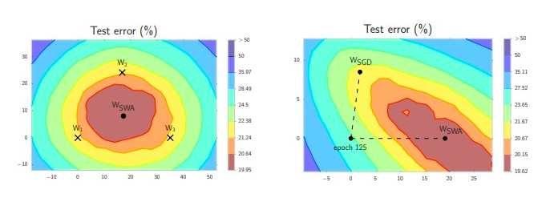

### 任务简述


* 在该任务中，我们开始对模型效果进行优化，这是大多数算法工程师的核心工作；效果优化是一项很open的工作内容，具备很大的不确定性，很多优化方案只在特定的业务场景下才能生效。这里我们需要剖析和实现两种优化方案：1，标签平滑技术；2，SWA优化器的使用。它们是两种原理较简单，但适用范围很广的优化方式。


### 任务目的

* 实现标签平滑损失和SWA优化器，并将其应用在基线模型上来提升指标。


### 任务步骤
	
* Step1: 实现标签平滑损失
* Step2: 应用标签平滑技术与效果验证
* Step3: SWA优化器原理解析
* Step4: 应用SWA优化器与效果验证

---


#### Step1: 实现标签平滑损失

* 当前步骤简述：
	* 在这一步，我们将阐述标签平滑的原理，应用条件，对应损失的实现。

* 标签平滑的原理：
	* 就是小幅度的改变原有标签值的值域，如[0, 0, 1] --> [0.1, 0.1, 0.8]，它适用于人工的标注数据可能并非完全正确的情况, 可以使用标签平滑来弥补这种偏差, 减少模型对某一条规律的绝对认知, 以防止过拟合和缓解语料质量问题。


* 应用条件：
	* 标注语料规模较大，标注的出错率较大（语料质量存在一定问题），人工校验成本较高的场景。


* 有关实现的说明：
	* 标签平滑技术看似原理简单，但实现起来并不容易，因为像pytorch这样的工具中，当使用原生的交叉熵损失（CrossEntropyLoss()）时，要求标签值必须为整型，在这里我们不去修改交叉熵损失的源码，而是重新定义一个类似计算规则的标签平滑交叉熵损失。


* 代码实现位置：
	* /data/sentiment_project/smoothing.py


#### 让我们动手做起来吧！


* 代码实现：
	
```python
import torch
import torch.nn as nn

class LabelSmoothingCELoss(nn.Module):
    def __init__(self, classes, smoothing=0.0, dim=-1):
        super(LabelSmoothingCELoss, self).__init__()
        self.confidence = 1.0 - smoothing
        self.smoothing = smoothing
        self.cls = classes
        self.dim = dim

    def forward(self, pred, target):
        pred = pred.log_softmax(dim=self.dim)
        with torch.no_grad():
            true_dist = pred.data.clone()
            true_dist = torch.zeros_like(pred)
            true_dist.fill_(self.smoothing / (self.cls - 1))
            # .scatter_也是一种数据填充方法，目的仍然是将self.confidence填充到true_dist中
            # 第一个参数0/1代表填充的轴，大多数情况下使用scatter_都使用纵轴（1）填充
            # 第二个参数就是self.confidence的填充规则，即填充到第几列里面，如[[1], [2]]代表填充到第二列和第三列里面
            # 第三个参数就是填充的数值，int/float
            true_dist.scatter_(1, target.data.unsqueeze(1), self.confidence)
        return torch.mean(torch.sum(-true_dist * pred, dim=self.dim))

```


> * 运行示例：

```python
if __name__ == "__main__":
    predict = torch.FloatTensor([[1, 1, 1, 1, 1]])
    target = torch.LongTensor([2])
    LSL = LabelSmoothingCELoss(3, 0.03)
    print(LSL(predict, target))
```


```text
tensor(1.6577)
```

* 当前步骤总结：
	* 通过这一步，我们构建了一个新的损失函数LabelSmoothingCELoss，它与BERT之前的损失函数CELoss具有相同的功能，不过它具备了标签平滑的特性，我们会在接下来的任务中使用它。


---


#### Step2: 应用标签平滑技术与效果验证

* 当前步骤简述：
	* 通过上一步，我们已经实现了标签平滑损失，在这一步，我们将会使用它替换原来的损失函数进行训练，并得到优化效果。


* 修改位置：
	* /root/anaconda3/envs/ms3.7/lib/python3.7/site-packages/transformers/modeling_bert.py


```python hl_lines="13"
···
1036         pooled_output = self.dropout(pooled_output)
1037         logits = self.classifier(pooled_output)
1038
1039         outputs = (logits,) + outputs[2:]  # add hidden states and attention if they are here
1040
1041         if labels is not None:
1042             if self.num_labels == 1:
1043                 #  We are doing regression
1044                 loss_fct = MSELoss()
1045                 loss = loss_fct(logits.view(-1), labels.view(-1))
1046             else:
1047                 loss_fct = CrossEntropyLoss()
1048                 loss = loss_fct(logits.view(-1, self.num_labels), labels.view(-1))
1049             outputs = (loss,) + outputs
1050
1051         return outputs  # (loss), logits, (hidden_states), (attentions)
···
```

* 使用说明：
	* 在源码中添加函数，我们往往会将其封装成pypi工具包，防止需要管理过多的依赖文件，在这里，我们已经将标签平滑损失封装在pyaitools1.4.3之中，所以我们直接```pip install pyaitools==1.4.3```, 然后在源码中直接使用。


> * 使用方法：

```python
from pyaitools.loss import LabelSmoothingCELoss
loss_fct = LabelSmoothingCELoss(3, smoothing=0.1)
```
	


* 代码实现位置：
	* /root/anaconda3/envs/ms3.7/lib/python3.7/site-packages/transformers/modeling_bert.py


#### 让我们动手做起来吧！


* 代码实现：

```python hl_lines="13 14 15 16 17"
···
1036         pooled_output = self.dropout(pooled_output)
1037         logits = self.classifier(pooled_output)
1038
1039         outputs = (logits,) + outputs[2:]  # add hidden states and attention if they are here
1040
1041         if labels is not None:
1042             if self.num_labels == 1:
1043                 #  We are doing regression
1044                 loss_fct = MSELoss()
1045                 loss = loss_fct(logits.view(-1), labels.view(-1))
1046             else:
                     # 注释掉之前的交叉熵损失函数
1047                 # loss_fct = CrossEntropyLoss()
                     # 导入之前的LabelSmoothingCELoss，填入类别参数和平滑系数
1048                 from pyaitools.loss import LabelSmoothingCELoss
1049                 loss_fct = LabelSmoothingCELoss(3, smoothing=0.1)
1050                 loss = loss_fct(logits.view(-1, self.num_labels), labels.view(-1))
1051             outputs = (loss,) + outputs
1052
1053         return outputs  # (loss), logits, (hidden_states), (attentions)
···
```

> * 运行示例：

```shell
# 修改完该损失，我们就可以重新训练数据来验证效果
sh start_train.sh
```

* 标签平滑技术的效果：

<center>

|label smoothing|准确率|
|--|--|
|0.05|87.6%|
|0.10|88.3%|
|0.15|87.1%|
|0.20|86.8%|
|0.25|86.2%|

</center>

---

* 结果分析：
	* 在当前的数据上，标签平滑带来的效果提升大约0.8%，但在后期加大数据量级时，标签平滑将带来更显著效果。


* 当前步骤总结：
	* 通过这一步，我们应用了标签平滑技术，并进行了效果验证，虽然提升不大，但它确实一种普适性很强的优化方案，在大多数场景下都可以进行尝试。


---


#### Step3: SWA优化器原理解析

* 当前步骤简述：
	* 优化器部分的改进，是模型优化的一个重要方向。在这一步，我们将尝试针对优化器进行改进，SWA并不是传统的优化器，和SGD，Adam，Adagrad不同，它可以看作是它们的封装，关于更具体的原理，我们将在下面展开讲解。


* SWA的实验基础：
	* 作者在大量任务上使用传统优化器（SGD，Adam等）进行实验时，发现一种规律：传统优化器收敛到的最优解往往在真实数据最优解的附近，这是一种普遍的收敛不到位的现象。
	* 怎么解决这种问题呢，作者给出了一种简单直接的解决方案：对多次收敛到的最优解进行均值，获得平滑解，对梯度的最优解去均值就等价于对网络参数取均值（参数是根据梯度计算得到的），这种方法就是SWA（stochastic weight averaging）。





* SWA的实现逻辑：
	* 首先，我们知道SWA不是传统的优化器，它是针对原始优化器更新的参数取均值。
	* 所以，SWA的实现逻辑中，最重要的就是指明该如何取均值。我们举例说明这个过程：
		* 假设这是一个30epoch的训练过程，使用来AdamW作为基础优化器
		* 在前面的一些轮次（比如前10轮），一般SWA不会介入，需要模型进行稳定梯度更新状态
		* 从第10轮开始，我们会给SWA设置一个周期，比如设置5轮，意味着，每5轮训练结束，SWA的机制被触发，这个机制做的事情很简单，开辟一块内存，存储当前的模型参数（等价于存最优解）
		* 这样，后面的20轮，我们会存4次模型参数，在模型使用时，就是将这些参数进行均值化进行使用（不会用之前训练的最后的参数）。
		* SWA另外的一个特点就是在后面的20轮里，往往会设定一个较高的学习率，在实验中，这样的设定将带来更好的泛化。


* SWA工具使用：
	* 我们将使用torchcontrib.optim提供的方法，以下代码主要看一看主要参数含义即可

```python
from torchcontrib.optim import SWA

...
...

# training loop
base_opt = torch.optim.SGD(model.parameters(), lr=0.1)

# 参数：
# base_opt：基础的优化，可以是SGD，也可以是AdamW
# swa_start：SWA开始介入的起始轮次
# swa_freq：SWA参数存储的周期
# swa_lr：SWA阶段的学习率
opt = torchcontrib.optim.SWA(base_opt, swa_start=10, swa_freq=5, swa_lr=0.05)
for _ in range(100):
     opt.zero_grad()
     loss_fn(model(input), target).backward()
     opt.step()
opt.swap_swa_sgd()
```

* 当前步骤总结：
	* 通过这一步，我们主要来理解SWA的实验基础，了解实现逻辑和工具，为了之后在我们的项目中使用它打下基础。


---


#### Step4: 应用SWA优化器与效果验证

* 当前步骤简述：
	* 在这一步，我们将之前学习的SWA优化器应用在项目之中，主要实现SWA与项目代码的结合。


* 修改位置：
	* 我们在训练过程中使用优化器的代码部分进行修改。
	* /data/sentiment_project/run_glue.py 


```python hl_lines="8"
101     # Prepare optimizer and schedule (linear warmup and decay)
102     no_decay = ['bias', 'LayerNorm.weight']
103     optimizer_grouped_parameters = [
104         {'params': [p for n, p in model.named_parameters() if not any(nd in n for nd in no_decay)]    , 'weight_decay': args.weight_decay},
105         {'params': [p for n, p in model.named_parameters() if any(nd in n for nd in no_decay)], 'w    eight_decay': 0.0}
106         ]
107
108     optimizer = AdamW(optimizer_grouped_parameters, lr=args.learning_rate, eps=args.adam_epsilon)
109     scheduler = get_linear_schedule_with_warmup(optimizer, num_warmup_steps=args.warmup_steps, num    _training_steps=t_total)
110     if args.fp16:
111         try:
112             from apex import amp
113         except ImportError:
114             raise ImportError("Please install apex from https://www.github.com/nvidia/apex to use     fp16 training.")
115         model, optimizer = amp.initialize(model, optimizer, opt_level=args.fp16_opt_level)
```

* 修改内容：
	* 找到使用优化器的部分，BERT使用的优化器是AdamW
	* 我们在里面添加一项在参数，对SWA是可以选择使用的，如果为True则使用，False则不使用
	* 具体的添加代码参考上一步的SWA使用


#### 让我们动手做起来吧！


* 代码修改位置一：
	* 添加控制参数

```python hl_lines="8"
351                         help="Path to pre-trained model or shortcut name selected in the list: " +     ", ".join(ALL_MODELS))
352     parser.add_argument("--task_name", default=None, type=str, required=True,
353                         help="The name of the task to train selected in the list: " + ", ".join(pr    ocessors.keys()))
354     parser.add_argument("--output_dir", default=None, type=str, required=True,
355                         help="The output directory where the model predictions and checkpoints wil    l be written.")
356
357     ## Other parameters
358     parser.add_argument("--is_swa", default=False, help="Whether to use swa")
359     parser.add_argument("--config_name", default="", type=str,
360                         help="Pretrained config name or path if not the same as model_name")
361     parser.add_argument("--tokenizer_name", default="", type=str,
362                         help="Pretrained tokenizer name or path if not the same as model_name")
363     parser.add_argument("--cache_dir", default="", type=str,
364                         help="Where do you want to store the pre-trained models downloaded from s3    ")
365     parser.add_argument("--max_seq_length", default=128, type=int,
```


* 代码修改位置二：
	* 添加优化器
```python hl_lines="8 9 10 11"
101     # Prepare optimizer and schedule (linear warmup and decay)
102     no_decay = ['bias', 'LayerNorm.weight']
103     optimizer_grouped_parameters = [
104         {'params': [p for n, p in model.named_parameters() if not any(nd in n for nd in no_decay)]    , 'weight_decay': args.weight_decay},
105         {'params': [p for n, p in model.named_parameters() if any(nd in n for nd in no_decay)], 'w    eight_decay': 0.0}
106         ]
107     optimizer = AdamW(optimizer_grouped_parameters, lr=args.learning_rate, eps=args.adam_epsilon)
108     if args.is_swa:
109         import torchcontrib
110         optimizer = torchcontrib.optim.SWA(optimizer, swa_start=20, swa_freq=5)
111
112
113     scheduler = get_linear_schedule_with_warmup(optimizer, num_warmup_steps=args.warmup_steps, num    _training_steps=t_total)
114     if args.fp16:
115         try:
116             from apex import amp
117         excpt ImportError:
```


* 代码修改位置三：
	* 参数按照SWA机制进行更新

```python hl_lines="6 7 8"
201
202             if args.max_steps > 0 and global_step > args.max_steps:
203                 epoch_iterator.close()
204                 break
205
206         if args.is_swa and (_ + 1 == args.num_train_epochs):
207             logger.info("add xx:now do swap_swa_sgd")
208             optimizer.swap_swa_sgd()
209
210         if args.max_steps > 0 and global_step > args.max_steps:
211             train_iterator.close()
212             break
213
214     if args.local_rank in [-1, 0]:
215         tb_writer.close()
216
217     return global_step, tr_loss / global_step
```


* 在start_train.sh中添加swa参数：

```pyhton hl_lines="6"
...
python run_glue.py \
  --model_type BERT \
  --model_name_or_path bert-base-multilingual-cased \
  --task_name MNLI-MM \
  --is_swa True \
  --do_train \
  --do_eval \
  --data_dir $DATA_DIR/ \
  --max_seq_length 40 \
  --weight_decay 0.01 \
  --learning_rate 2e-4 \
  --num_train_epochs 50 \
  --save_steps 1000 \
  --logging_steps 1000 \
  --overwrite_output_dir \
  --output_dir $SAVE_DIR
```


> * 运行示例：

```
sh start_train.sh
```


* SWA参数组的效果：


<center>

|swa_start|swa_freq|准确率|
|--|--|--|
|10|5|90.8%|
|20|5|91.8%|
|30|5|91.1%|
|40|5|91.6%|

</center>
 

* 当前步骤总结：
	* 到这里，我们完成了SWA在项目中的应用，做了一系列的对比实验，最大ACC相比之前提升3%左右，起到了一定效果，更多参数组合在不同的数据集下的表现略有不同，大家可以自己进行尝试。


---
